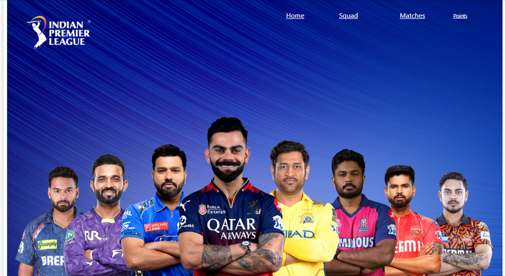
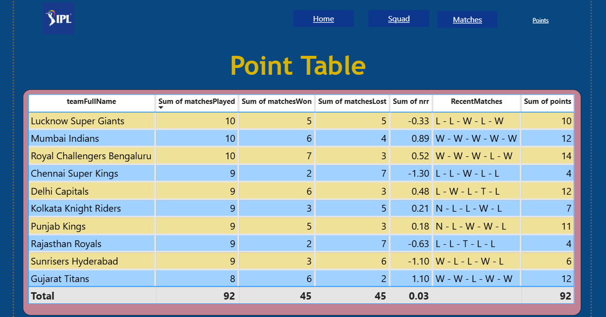
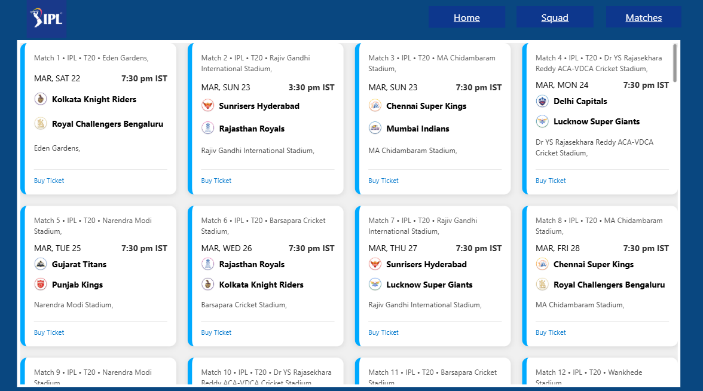
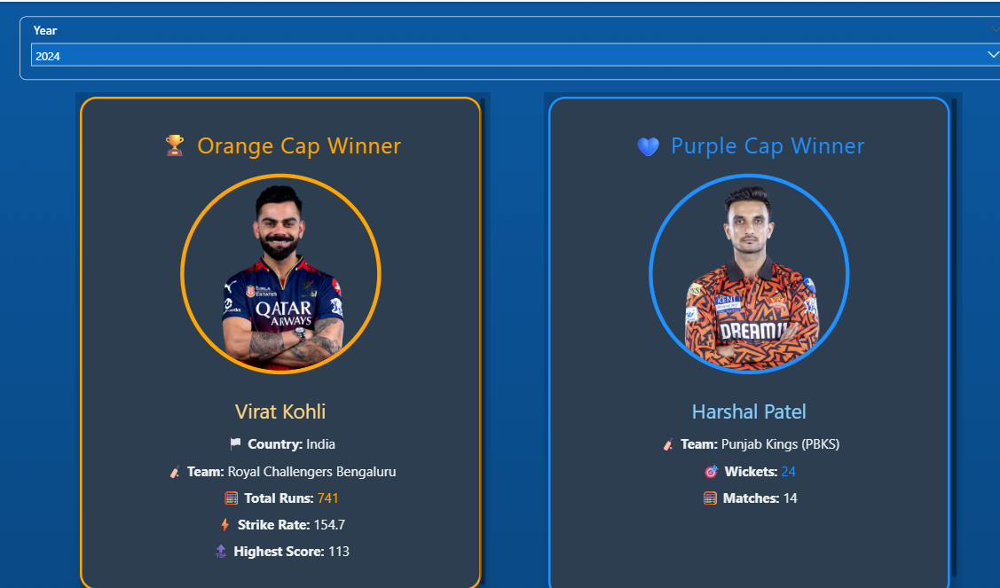
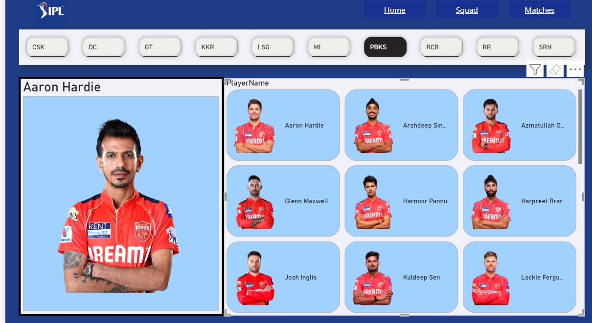
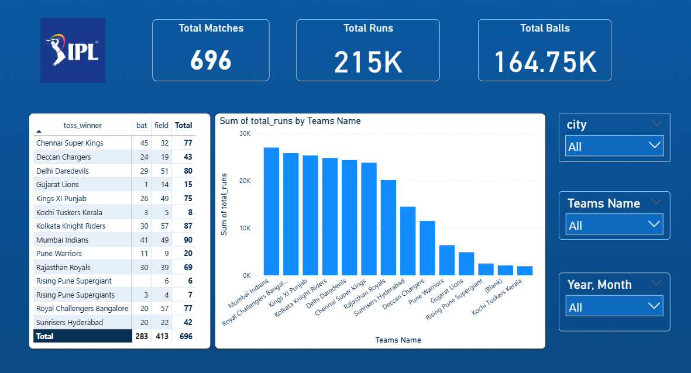
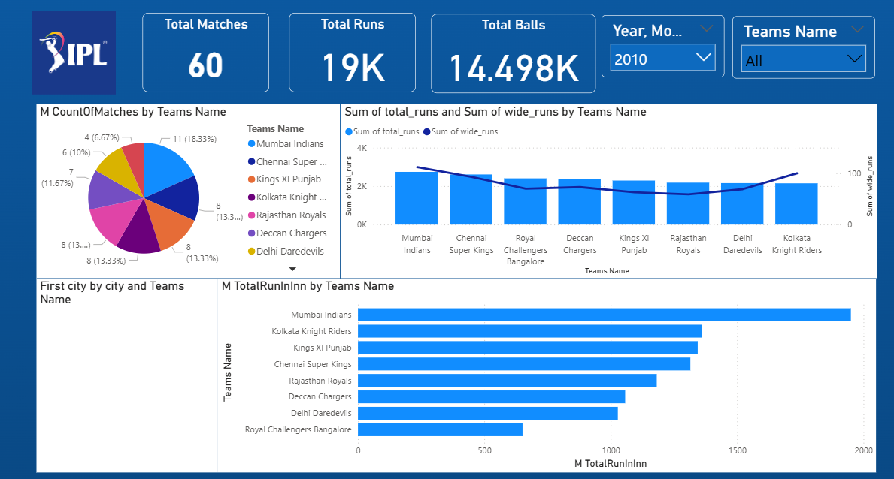
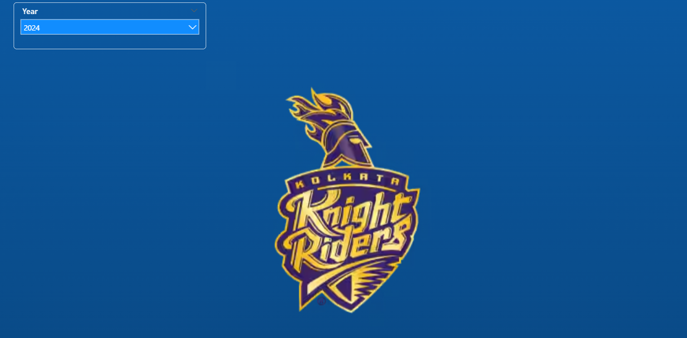

# 🏏 IPL Cricket Analytics Dashboard – Power BI

## 📌 Project Overview
This project is an **interactive Power BI dashboard** providing in-depth analysis of the **Indian Premier League (IPL)**.  
The dashboard offers insights into team standings, player performance, historical match statistics, and upcoming fixtures.  
Its goal is to help cricket enthusiasts, analysts, and team managers explore trends and make data-driven conclusions.

---

## 📊 Data Sources
The dataset contains IPL match and player performance data from multiple seasons.  
It includes:
- Match results
- Player statistics
- Points table standings
- Schedule details

**Source:** [Specify source, e.g., Kaggle IPL Dataset or official IPL data]

---

## 🛠 Tools & Technologies
- **Power BI** – Data modeling, DAX measures, interactive visualizations
- **Microsoft Excel / CSV** – Data cleaning and preprocessing
- **DAX** – Custom measures and KPIs
- **Power Query** – Data transformation

---

## 📈 Dashboard Features

### 1️⃣ Team Performance
- Matches played, wins, losses, NRR (Net Run Rate), and points
- Points table ranking for the season

### 2️⃣ Player Leaderboards
- **Orange Cap** – Top run scorers
- **Purple Cap** – Top wicket-takers
- Player strike rate and economy rate analysis

### 3️⃣ Historical Trends
- Runs, balls, and wides by team across seasons
- Match outcomes over time
- Team performance comparison

### 4️⃣ Match Schedule
- Upcoming fixtures with venue and date
- Team vs. team head-to-head

---

## 🔍 Key Insights
- Identified top-performing teams and players over multiple seasons
- Highlighted the most consistent run scorers and wicket-takers
- Analyzed team trends across different venues and years
- Provided quick reference for upcoming matches

---

## 📷 Dashboard Previews

### 🏆 Dashboard
  
*Shows Home page.*

### 🏆 Points Table
  
*Shows season standings with matches, wins, losses, NRR, and points.*

### 📅 Match Schedule
  
*Displays upcoming matches with date, venue, and participating teams.*

### 🥇 Orange Cap & Purple Cap Leaders
  
*Top run scorers with runs, strike rate, and boundaries & Top Wicket Takers.*

### 🎯 Team Players
  
*Shoes Each Team players.*

### 📊 Historical Team Runs
  
*Team-wise total runs over IPL seasons.*

### ⚡ Balls and Wides Analysis
  
*Comparison of balls bowled and wides conceded per team.*

### 📍 Champion Team per year
  

---

